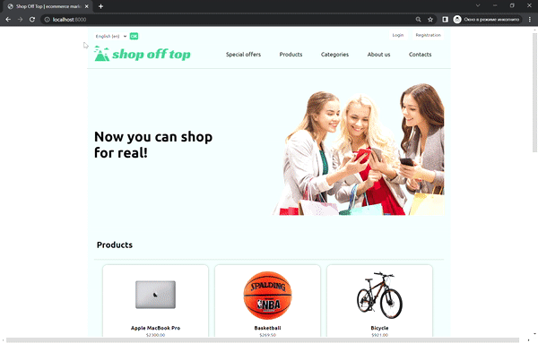

# Ecommerce store

___

## Description

### Website for shopping online :shopping_cart:

---

Project provides the following services:
- registration;
- authorization;
- admin panel;
- personal user account.
---
User is able to:
- edit profile;
- add products to cart;
- pay order using debit/credit card (payments are handled by 
braintree);
- see the order history.
___

## Set up

Create a virtual environment with the following command:
`python -m venv env`

After activating the virtual environment, use the command below to install the required dependencies:
`pip install -r requirements.txt`

The `requirements.txt` file is located at the project root.

---